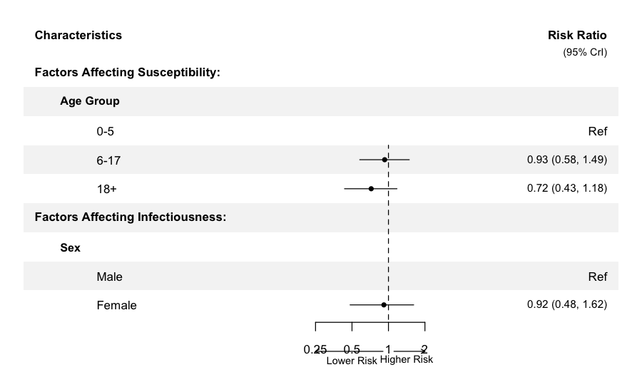
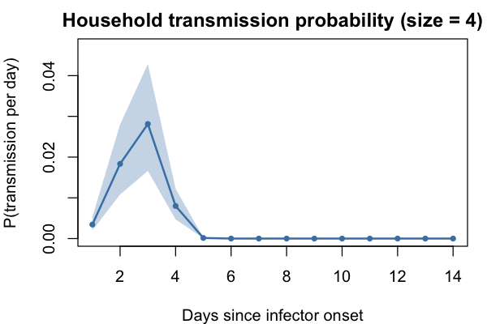
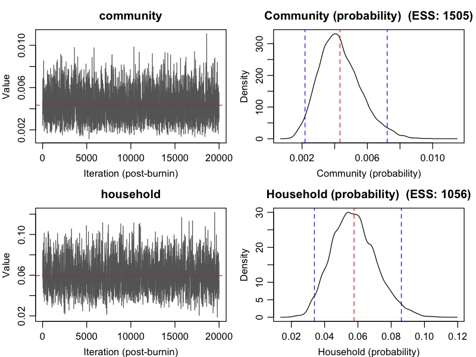
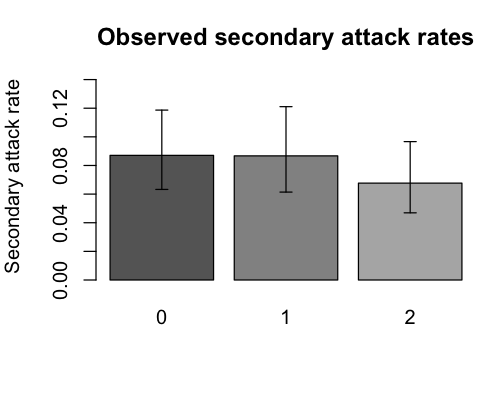

<!-- This README is maintained directly. Do not regenerate from README.Rmd. -->

# hhdynamics

[](https://www.repostatus.org/#active)

**hhdynamics** fits Bayesian household transmission models to case-ascertained household studies. It estimates infection risk among household contacts based on time since illness onset, incorporating covariates for infectivity and susceptibility, and accounting for community infection sources. The MCMC backend is written in C++ via Rcpp/RcppArmadillo for speed.

## Features

- **Bayesian MCMC estimation** of household transmission parameters with community infection
- **Covariate effects** on infectivity and susceptibility via R formula interface (`~sex`, `~age + vaccination`)
- **Serial interval estimation** — jointly estimate Weibull SI parameters from data (`estimate_SI = TRUE`)
- **Missing data handling** — automatic Bayesian imputation of missing factor covariates and onset times
- **Publication-ready plots** — MCMC diagnostics, transmission curves, forest plots of covariate effects, attack rates
- **Summary tables** — parameter estimates, covariate effects (relative risks), secondary attack rates with CIs
- **S3 methods** — `print()`, `summary()`, `coef()`, `plot()` for fitted model objects

## Installation

```r
# install.packages("devtools")
devtools::install_github("timktsang/hhdynamics")
```

## Quick start

```r
library(hhdynamics)
data(inputdata)

# Fit model with covariates (uses default influenza serial interval)
fit <- household_dynamics(inputdata,
  inf_factor = ~sex, sus_factor = ~age,
  n_iteration = 30000, burnin = 10000, thinning = 1)

summary(fit)
```

## Visualization

### Covariate effects (forest plot)

```r
plot_covariates(fit, file = "covariates.pdf",
  labels = list(
    sex = list(name = "Sex", levels = c("Male", "Female")),
    age = list(name = "Age Group", levels = c("0-5", "6-17", "18+"))))
```



The forest plot auto-sizes the PDF dimensions based on the number of covariates. Custom labels can be provided for variable headers and factor levels.

### Transmission probability over time

```r
plot_transmission(fit)
```



### MCMC diagnostics

```r
plot_diagnostics(fit)
```



### Secondary attack rates

```r
plot_attack_rate(fit, by = ~age)
```



## Tables

```r
# Parameter estimates on natural scale
table_parameters(fit)

# Covariate effects as relative risks with CrIs
table_covariates(fit)

# Secondary attack rates with Wilson CIs
table_attack_rates(fit, by = ~age)
```

## Advanced features

### Joint serial interval estimation

Estimate the serial interval distribution from the data as a Weibull(shape, scale):

```r
fit_si <- household_dynamics(inputdata, ~sex, ~age,
  estimate_SI = TRUE, n_iteration = 30000, burnin = 10000)
summary(fit_si)  # includes si_shape, si_scale
```

### Missing data imputation

Missing factor covariates and missing onset times for infected contacts are automatically imputed during MCMC via Bayesian data augmentation:

```r
# Works with NAs in factor covariates and contact onset times
inputdata$age[c(5, 10, 15)] <- NA
fit_missing <- household_dynamics(inputdata, ~sex, ~age,
  n_iteration = 30000, burnin = 10000)
```

### Custom serial interval

```r
my_SI <- c(0, 0.01, 0.05, 0.15, 0.25, 0.25, 0.15, 0.08, 0.04, 0.015, 0.005, 0, 0, 0)
fit_custom <- household_dynamics(inputdata, SI = my_SI,
  n_iteration = 30000, burnin = 10000)
```

## Citation

Tsang TK, Cauchemez S, Perera RA, Freeman G, Fang VJ, Ip DK, Leung GM, Malik Peiris JS, Cowling BJ. (2014). Association between antibody titers and protection against influenza virus infection within households. *J Infect Dis.* 210(5):684-92.

## Development

Code development assisted by AI tools (Codex, OpenAI).
