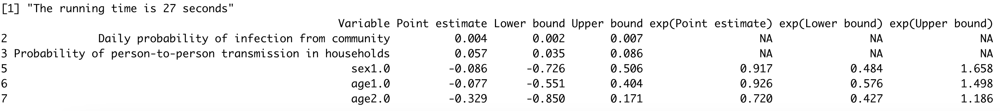

<!-- README.md is generated from README.Rmd. Please edit that file -->

# hhdynamics

[](https://www.repostatus.org/#active)

`hhdynamics` is a household transmission model that can fit to the
case-ascertained household transmission studies. This model describes
the risk of PCR-confirmed infection among household contacts as
depending on time since illness. This is an individual-based hazard
model that can characterize influenza transmission dynamics within
households and estimate the effects of factors affecting transmission.
The model is fitted in a Bayesian modeling framework.

While the package currently provides a set of fundamental functions, we
are actively working on expanding its capabilities with more advanced
tools for a comprehensive understanding of your results.

## Installation

1.  Install \[R\]\[r-project\]

2.  Install the development version of hhdynamics from
    [GitHub](https://github.com/timktsang/hhdynamics):

``` r
devtools::install_github("timktsang/hhdynamics")
library(hhdynamics)
```

## Example

This is a basic example of how to load data from a household
transmission study and fit the model using the MCMC framework.

``` r
library(hhdynamics)
data("inputdata")

# Fit with covariates (uses default influenza serial interval)
fit <- household_dynamics(inputdata, inf_factor = ~sex, sus_factor = ~age,
  n_iteration = 15000, burnin = 5000, thinning = 1)
summary(fit)

# Jointly estimate the serial interval from data
fit_si <- household_dynamics(inputdata, inf_factor = ~sex, sus_factor = ~age,
  n_iteration = 15000, burnin = 5000, thinning = 1, estimate_SI = TRUE)
summary(fit_si)  # includes si_shape and si_scale

# Use a custom serial interval
my_SI <- c(0, 0.01, 0.05, 0.15, 0.25, 0.25, 0.15, 0.08, 0.04, 0.015, 0.005, 0, 0, 0)
fit_custom <- household_dynamics(inputdata, SI = my_SI,
  n_iteration = 15000, burnin = 5000, thinning = 1)
```

<figure>

<figcaption aria-hidden="true">The output of the MCMC
results.</figcaption>
</figure>

## Development

Code development assisted by AI tools (Claude, Anthropic; Codex, OpenAI).

## Citation

To cite package **hhdynamics** in publications use:

Tsang TK, Cauchemez S, Perera RA, Freeman G, Fang VJ, Ip DK, Leung GM,
Malik Peiris JS, Cowling BJ. (2014). Association between antibody titers
and protection against influenza virus infection within households. J
Infect Dis. 2014 Sep 1;210(5):684-92
